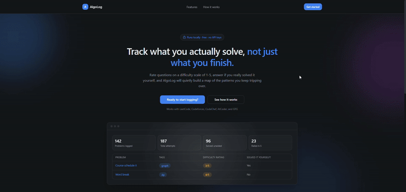

<div align="center">

# AlgoLog

**Self-rate your CP submissions, revisit what didn't stick.**

Log every LeetCode / Codeforces / CodeChef / AtCoder / GFG problem you attempt with a 1–5
difficulty score and an honest "did I actually solve this myself?" flag. AlgoLog finds
problems similar to ones you struggled with, resurfaces weak ones on a spaced-repetition
schedule, answers questions from your own uploaded notes, and emails a weekly digest — self-hosted,
and your practice history never leaves your machine.

[](https://python.org)
[](https://fastapi.tiangolo.com)
[](https://react.dev)
[](https://github.com/pgvector/pgvector)
[](https://modelcontextprotocol.io)
[](https://github.com/trimoyee-g/AlgoLog/actions/workflows/backend-tests.yml)

[Architecture](docs/architecture.md) ·
[API Reference](docs/api-reference.md) ·
[MCP Server](docs/mcp-server.md) ·
[Environment Variables](docs/environment-variables.md) ·
[Testing](docs/testing.md) ·
[Design Decisions](docs/design-decisions.md)

</div>

---

## Demo



## Overview

Three ways in, one brain behind them:

- **Browser extension** — click the toolbar icon on a problem page and rate the submission
  you just made. The platform is inferred from the tab URL.
- **React dashboard** — add, edit, and filter problems, find similar ones, work the review
  queue, upload study PDFs to ask questions against, and see what to revisit next with the
  reason it was picked.
- **MCP server** — ask Claude _"what should I revisit next?"_ and let it call your tracker
  as tools, including search over your own study notes.

Everything that _guides_ your practice is deterministic: embeddings run in-process via
`sentence-transformers`, and the SM-2 scheduler, weak-topic detection, and recommender are
plain rules — so every suggestion is reproducible. Auth is delegated to Supabase (JWT); the
backend verifies tokens against the project JWKS and never stores a password.

An **optional chat model** does the two jobs that need generation, and nothing else. It appends
tips and practice problems to an already-complete weekly digest, and it rewrites queries and
writes answers in the study-material RAG loop — where passage grading stays with a cross-encoder,
not the LLM. Set `GEMINI_API_KEY` (free tier, seconds per answer) or `OLLAMA_MODEL` for a fully
local one; Gemini wins when both are set. With neither, or when the model is unreachable, both
features degrade rather than fail: the digest sends its deterministic content, and asking returns
graded passages with no answer.

Two features reach the public internet on their own, both keyless via `ddgs`: the digest's problem
suggestions, and the RAG loop's web fallback when your own notes turn up nothing. Beyond those and
the chat model you choose, everything stays local.

Full system diagram, data model, and sequence diagrams: [docs/architecture.md](docs/architecture.md).

## Features

| Feature                  | How it works                                                                                                                                                  |
| ------------------------ | ------------------------------------------------------------------------------------------------------------------------------------------------------------- |
| **Self-rating**          | Each attempt logs a 1–5 score, a `solved_self` flag, tags, and notes. Repeat attempts are kept as history, never overwritten.                                  |
| **Similarity search**    | Tags are embedded with `all-MiniLM-L6-v2` into pgvector; "find similar" returns the closest matches from _your own_ history.                                   |
| **Spaced repetition**    | An SM-2 variant folded over the immutable attempt log — a struggle resets the interval to 1 day, clean recalls stretch it (1 → 6 → ×ease). No scheduler state. |
| **Weak-topic detection** | Per tag, the 90-day solved-unaided rate. Weak = below 50% _and_ ≥3 attempts, so one bad problem never brands a topic.                                          |
| **Recommend next**       | Merges due reviews and weak topics into one ranked list; `high` priority means overdue **and** weak. Each carries a plain-English `reason`.                    |
| **Weekly digest**        | An APScheduler job emails a Sunday summary over SMTP: week stats with trend, top-5 due problems, and a coach note. Also triggerable from the dashboard.        |
| **Digest enrichment**    | _Optional._ With a chat model configured, it appends tips and web-searched problems (keyless `ddgs`). Any failure sends the plain digest.                       |
| **Study material**       | Upload a PDF (≤`MAX_UPLOAD_MB`, default 20); text is extracted, chunked, and embedded into pgvector. The file itself is never stored, only its text.           |
| **Ask your notes**       | A corrective-RAG loop: vector search → cross-encoder grading → query rewrite if thin → web fallback if empty → grounded answer. Retrieval works with no LLM.    |
| **MCP tools**            | Query the tracker from any MCP client: weak problems, overall stats, the reasoned "recommend next", and search over your uploaded study material.               |

## Getting Started

**Prerequisites:** Docker Desktop · Node 18+ · a free [Supabase](https://supabase.com) project.

### 1. Backend

```bash
cp .env.example .env                  # Postgres user/password/db — no defaults, compose won't start without them
cp backend/.env.example backend/.env  # set SUPABASE_PROJECT_URL (required); SMTP_* for the weekly email

docker compose up -d --build          # runs `alembic upgrade head`, then serves
```

Verify: `http://localhost:8000/health` → `{"status":"ok"}` · Docs: `/docs`

The generation features (digest enrichment, RAG answers) need a chat model. Easiest is a free
[Gemini key](https://aistudio.google.com/apikey) in `backend/.env` — it takes precedence and answers
in seconds. For a fully local setup, compose already starts an **Ollama** service with
`OLLAMA_MODEL=llama3.1`; pull the model once with `docker compose exec ollama ollama pull llama3.1`
(~4.7GB). With neither, everything else still works.

The schema is owned by Alembic, not the app. The container migrates on boot; by hand:
`docker compose exec backend alembic upgrade head`. Upgrading a deployment that predates
migrations: `alembic stamp 0001` once, then `upgrade head`.

### 2. Dashboard

```bash
cd frontend
cp .env.example .env   # VITE_SUPABASE_URL, VITE_SUPABASE_ANON_KEY
npm install && npm run dev   # http://localhost:5173
```

### 3. Extension

Go to `chrome://extensions` → **Developer mode** → **Load unpacked** → select `extension/`.
Log in on the dashboard and the extension picks up that session automatically via its bridge
content script. Then click the toolbar icon on any problem page to rate it.

It's manifest-v3 and cross-browser (Chrome / Edge / Firefox / Safari). It never bundles the
Supabase SDK or calls Supabase itself — see [Design Decisions](docs/design-decisions.md).

### 4. MCP server (optional)

Ask Claude what to revisit next without opening the dashboard — hosted (recommended) or
stdio setup, both covered in [docs/mcp-server.md](docs/mcp-server.md).

## Reference

| Topic                    | Doc                                              |
| ------------------------- | ------------------------------------------------- |
| System diagram, data model, sequence flows | [docs/architecture.md](docs/architecture.md) |
| REST endpoints             | [docs/api-reference.md](docs/api-reference.md)     |
| MCP tools & setup           | [docs/mcp-server.md](docs/mcp-server.md)           |
| Config & env vars          | [docs/environment-variables.md](docs/environment-variables.md) |
| Test suite                 | [docs/testing.md](docs/testing.md)                 |
| Why it's built this way    | [docs/design-decisions.md](docs/design-decisions.md) |

## Testing

```bash
cd backend
pip install -r requirements-dev.txt
pytest tests/unit
```

Full suite (unit, integration, E2E) and CI details: [docs/testing.md](docs/testing.md).

## Contributing

Contributions are welcome. Open an issue first for anything large or design-changing.
