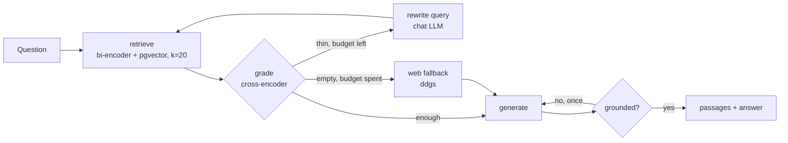
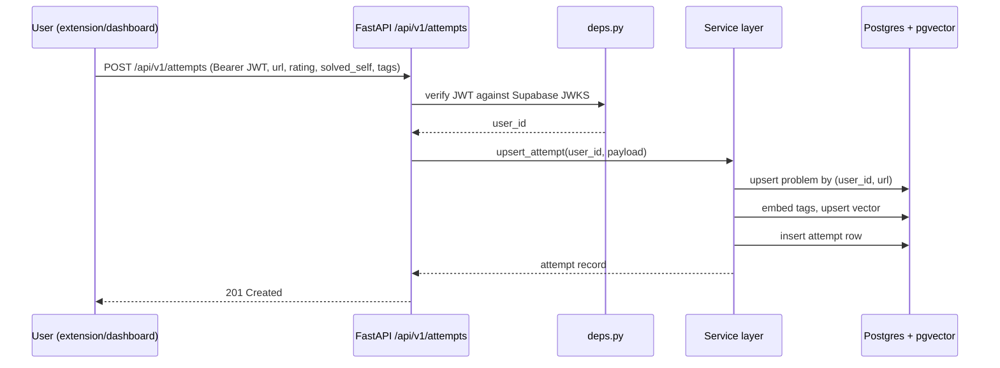
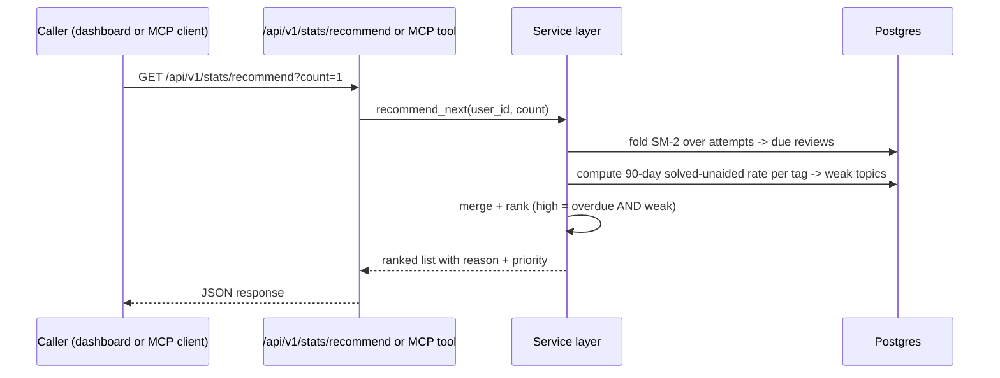
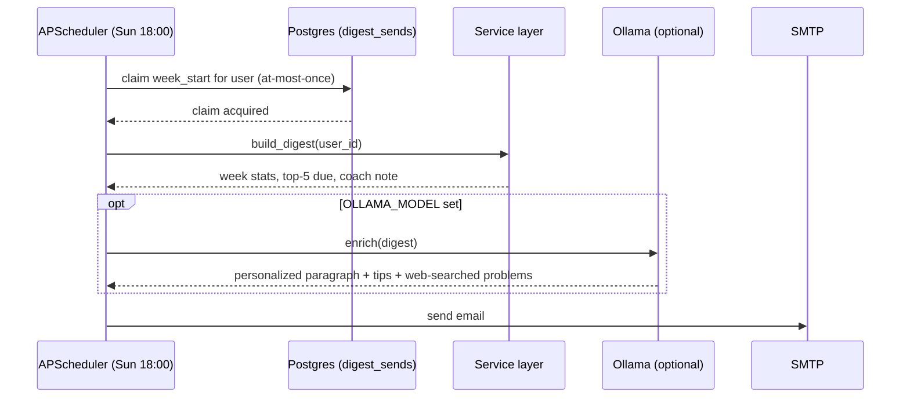

# Architecture

## Data model

| Table          | Key columns                                                              | Notes                                                                 |
| -------------- | ------------------------------------------------------------------------ | --------------------------------------------------------------------- |
| `users`        | `id` (Supabase UUID), `email`                                            | Upserted on first verified token; no password ever stored             |
| `problems`     | `id`, `user_id`, `url`, `platform`, `title`, `tags`, `embedding`         | One row per (user, URL); `embedding` is a pgvector column over `tags` |
| `attempts`     | `id`, `problem_id`, `rating` (1–5), `solved_self`, `notes`, `created_at` | Append-only — repeat attempts add rows, never overwrite history       |
| `digest_sends` | `user_id`, `week_start`, `sent_at`                                       | At-most-once claim table so the weekly job can't double-send          |
| `documents`    | `id`, `user_id`, `filename`, `pages`                                     | One uploaded study PDF; the file itself isn't kept, only its text     |
| `chunks`       | `id`, `document_id`, `user_id`, `ordinal`, `text`, `embedding`           | Retrievable passages; `user_id` denormalised so search needs no join  |

The SM-2 schedule (interval, ease, repetitions) and the weak-topic rate are not stored —
both are derived by folding over `attempts` at read time, so the schedule is always a pure
function of history. See [Design Decisions](design-decisions.md) for why.

## Sequence: ask your study material (corrective RAG)

Grading is a cross-encoder rather than the chat model: it scores question and passage
_jointly_, which the retrieval bi-encoder structurally cannot, in one batched CPU call
instead of twenty generations. The chat model only routes, rewrites, and writes. Without
`OLLAMA_MODEL` the graph is retrieve+grade and the caller (Claude, via MCP) writes the answer.

## Sequence: rate an attempt

## Sequence: recommend next

## Sequence: weekly digest

