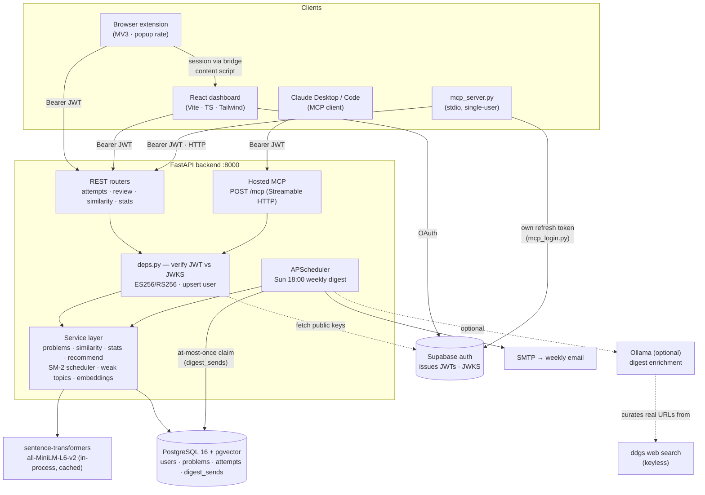
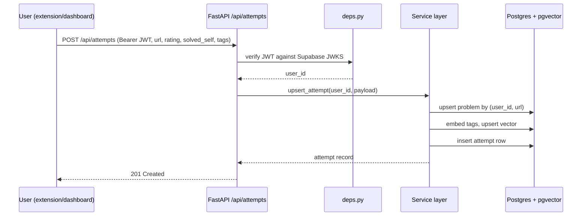
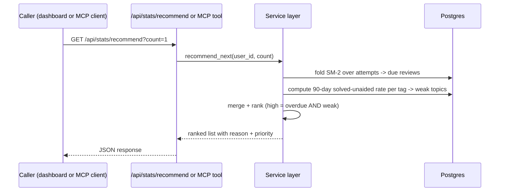
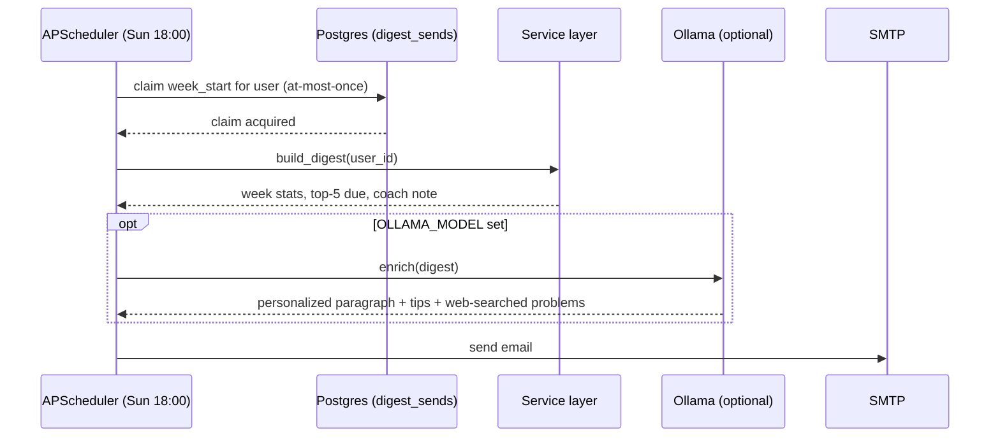

# Architecture

## System diagram

Three clients — the browser extension, the React dashboard, and any MCP client (Claude
Desktop, Claude Code, or the bundled stdio server) — all authenticate against Supabase and
call the same FastAPI backend with a bearer JWT. `deps.py` verifies every token against the
project's JWKS before the service layer runs; the service layer is the single place that
touches Postgres, the embedding model, and the SM-2 scheduler, so REST and MCP requests get
identical behavior.

## Data model

| Table          | Key columns                                                              | Notes                                                                 |
| -------------- | ------------------------------------------------------------------------ | ---------------------------------------------------------------------- |
| `users`        | `id` (Supabase UUID), `email`                                            | Upserted on first verified token; no password ever stored              |
| `problems`     | `id`, `user_id`, `url`, `platform`, `title`, `tags`, `embedding`         | One row per (user, URL); `embedding` is a pgvector column over `tags`  |
| `attempts`     | `id`, `problem_id`, `rating` (1–5), `solved_self`, `notes`, `created_at` | Append-only — repeat attempts add rows, never overwrite history         |
| `digest_sends` | `user_id`, `week_start`, `sent_at`                                       | At-most-once claim table so the weekly job can't double-send            |

The SM-2 schedule (interval, ease, repetitions) and the weak-topic rate are not stored —
both are derived by folding over `attempts` at read time, so the schedule is always a pure
function of history. See [Design Decisions](design-decisions.md) for why.

## Sequence: rate an attempt

## Sequence: recommend next

## Sequence: weekly digest

